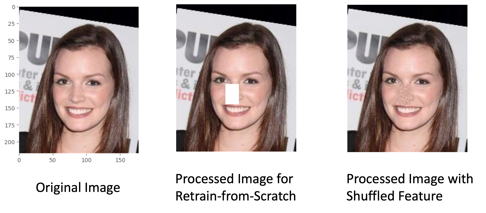
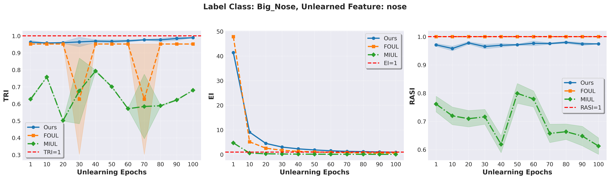
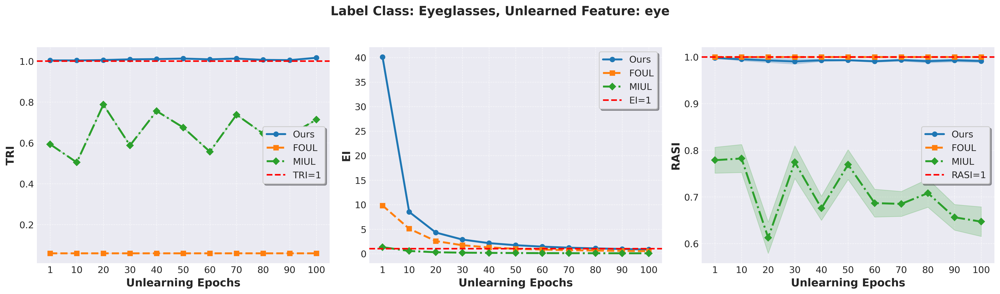
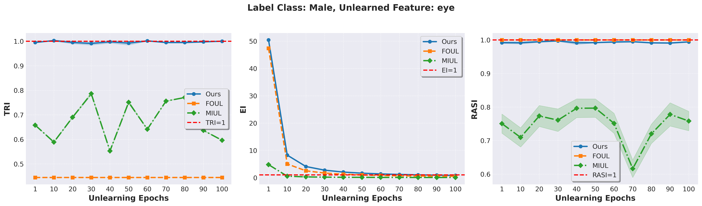
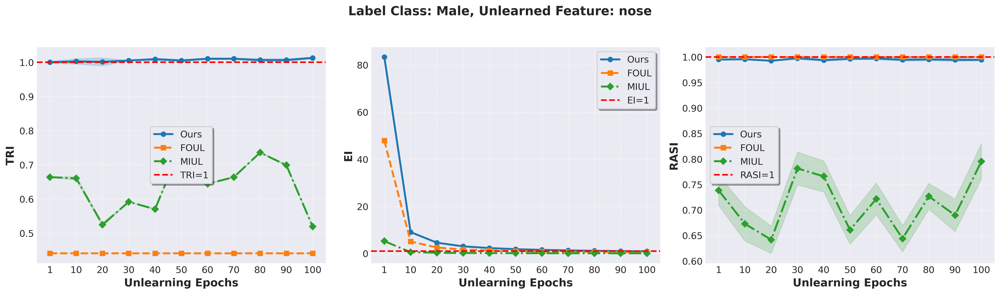
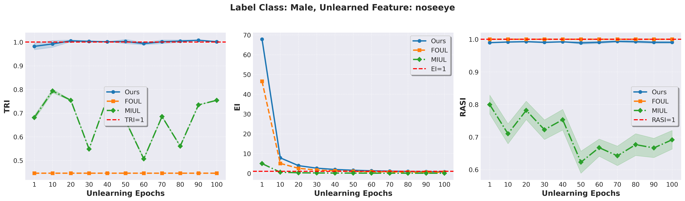
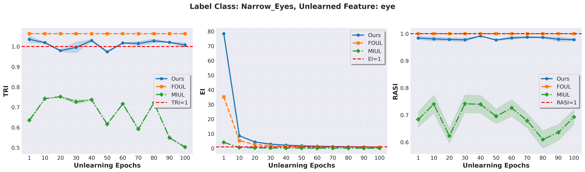
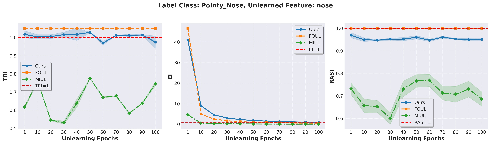

This repository includes the experimental setup, code, and results for the rebuttal of our paper \#13751, "**Efficient Feature Unlearning Using Shuffling: Algorithm and Theoretical Analysis.**". It offers additional details addressing three key aspects raised by the reviewers:

## Advanced Model Architectures

|  |  |  |
| :----------------------------------------------------------: | :----------------------------------------------------------: | :----------------------------------------------------------: |
|                   <em>TRI MLP Results for Top Two Important (identified by Shapley values) Features</em>                   |                <em>TRI FtFormer Results for Top Two Important(identified by Shapley values) Features</em>                 |                 <em>TRI ResNet Results for Top Two Important(identified by Shapley values) Features</em>                  |

|  |  |  |
| :----------------------------------------------------------: | :----------------------------------------------------------: | :----------------------------------------------------------: |
|                   <em>EI MLP Results for Top Two Important (identified by Shapley values) Features</em>                    |                 <em>EI FtFormer Results for Top Two Important (identified by Shapley values) Features</em>                 |                  <em>EI ResNet Results for Top Two Important (identified by Shapley values) Features</em>                  |

|  |  |  |
| :----------------------------------------------------------: | :----------------------------------------------------------: | :----------------------------------------------------------: |
|                  <em>RASI MLP Results for Top Two Important (identified by Shapley values) Features</em>                   |                <em>RASI FtFormer Results for Top Two Important (identified by Shapley values) Features</em>                |                 <em>RASI ResNet Results for Top Two Important (identified by Shapley values) Features</em>                 |

|  |  |  |
| :----------------------------------------------------------: | :----------------------------------------------------------: | :----------------------------------------------------------: |
|                   <em>SDI MLP Results for Top Two Important (identified by Shapley values) Features</em>                   |                <em>SDI FtFormer Results for Top Two Important (identified by Shapley values) Features</em>                 |                 <em>SDI ResNet Results for Top Two Important (identified by Shapley values) Features</em>                  |

|  |  |  |
| :----------------------------------------------------------: | :----------------------------------------------------------: | :----------------------------------------------------------: |
|                   <em>SRI MLP Results for Top Two Important (identified by Shapley values) Features</em>                   |                <em>SRI FtFormer Results for Top Two Important (identified by Shapley values) Features</em>                 |                 <em>SRI ResNet Results for Top Two Important (identified by Shapley values) Features</em>                  |


## Unlearning Features that are Highly Correlated with Other Features

We conducted experiments on highly correlated features to analyze the effects of unlearning interdependent features. Features with a correlation coefficient above 0.8 were selected. The code for computing feature correlations for each dataset is available in ``check_feature_correlation.ipynb``. These experiments were carried out using the same three architectural frameworks (MLP, FtFormer, ResNet) mentioned above. 

**Key Finding: Our algorithm exhibits remarkable efficiency in unlearning highly correlated features, a capability consistently demonstrated across MLP, ResNet, and FtFormer**

Highly correlated features in the *CALI* dataset:

- ``Latitude`` and ``Longitude``: 0.925
- `AveRooms` and `AveBedrms`: 0.848

Features Unlearned: **Latitude, Longitude, AveBedrms**

Highly correlated features in *CREDIT* dataset:

- `NumberOfTimes90DaysLate` and `NumberOfTime60-89DaysPastDueNotWorse`: 0.991
- `NumberOfTime30-59DaysPastDueNotWorse` and `NumberOfTime60-89DaysPastDueNotWorse`: 0.988
- `NumberOfTime30-59DaysPastDueNotWorse` and `NumberOfTimes90DaysLate`: 0.983

Features Unlearned: **NumberOfTimes90DaysLate, NumberOfTime30-59DaysPastDueNotWorse**


Highly correlated features in *MAGIC_TELE* dataset:

- `fConc`: and `fConc1`:: 0.975
- `fSize`: and `fConc`:: 0.847
- `fSize`: and `fConc1`:: 0.804

Features Unlearned: **fSize**

Experimental results are shown below.

### Results and Graphs


*Description: This graph illustrates the resulted evaluation metrics of unlearning the 'Latitude' feature using the MLP, ResNet, and FtFormer models. Our model's performance is consistent with observations reported in the main paper. It demonstrates robust performance across all evaluation criteria."*

*Description: This graph illustrates the resulted evaluation metrics of unlearning the 'Longtitude' feature using the MLP, ResNet, and FtFormer models. Our model's performance is consistent with observations reported in the main paper. It demonstrates robust performance across all evaluation criteria."*

*Description: This graph illustrates the resulted evaluation metrics of unlearning the 'AveBedrms' feature using the MLP, ResNet, and FtFormer models. Our model's performance is consistent with observations reported in the main paper. It demonstrates robust performance across all evaluation criteria."*

*Description: This graph illustrates the resulted evaluation metrics of unlearning the 'NumberOfTimes90DaysLate' feature using the MLP, ResNet, and FtFormer models. Our model's performance is consistent with observations reported in the main paper. It demonstrates robust performance across all evaluation criteria."s.*

*Description: This graph illustrates the resulted evaluation metrics of unlearning the 'NumberOfTime30-59DaysPastDueNotWorse' feature using the MLP, ResNet, and FtFormer models. Our model's performance is consistent with observations reported in the main paper. It demonstrates robust performance across all evaluation criteria."*

*Description: This graph illustrates the resulted evaluation metrics of unlearning the 'fSize' feature using the MLP, ResNet, and FtFormer models. Our model's performance is consistent with observations reported in the main paper. It demonstrates robust performance across all evaluation criteria."*


# Details for Responses to *Potential in complex tasks*

## Dataset Overview

CelebFaces Attributes Dataset (CelebA) is an extensive collection of over 200K celebrity images, each annotated with 40 binary facial attributes. The dataset captures a wide range of pose variations and background complexities. It offers remarkable diversity and volume, featuring 10,177 unique identities, 202,599 face images, and detailed annotations that include 5 landmark locations along with 40 binary attribute labels per image.


[CelebA reference] Z. Liu, P. Luo, X. Wang and X. Tang, "Deep Learning Face Attributes in the Wild," in 2015 IEEE International Conference on Computer Vision (ICCV), Santiago, Chile, 2015, pp. 3730-3738, doi: 10.1109/ICCV.2015.425.

## Model Modification

For the image classification task, we leverage the ViT as backbone and MLP as classifier head.

[ViT reference] Alexey Dosovitskiy, Lucas Beyer, Alexander Kolesnikov, Dirk Weissenborn, Xiaohua Zhai, Thomas Unterthiner, Mostafa Dehghani, Matthias Minderer, Georg Heigold, Sylvain Gelly, Jakob Uszkoreit, Neil Houlsby:
An Image is Worth 16x16 Words: Transformers for Image Recognition at Scale. ICLR 2021

## Experiments

In tabular datasets, each column represents a distinct feature, making feature selection and manipulation explicit. In contrast, for computer vision tasks, features are visually embedded within images and not explicitly structured as separate variables. For instance, in the CelebA dataset, facial attributes such as the nose, eyes, and gender are inherently captured within each image rather than existing as distinct columns.

To extend our unlearning method to the image classification setting, we focus on selectively unlearning specific visual features of the CelebA dataset, including:
- Nose
- Eye
- Nose and Eye

The classification tasks involve predicting the following labels:
- Gender (Male or Female)
- Big Nose
- Pointy Nose
- Eyeglasses
- Narrow Eyes

The detailed descriptions of the performed unlearning tasks are provided below

- **Unlearn Nose (Label Gender):**  
  Remove extraneous background details using the annotated nose locations.
- **Unlearn Eyes (Label Gender):**  
  Exclude the eye regions based on the provided annotations.
- **Unlearn Noise+Eyes (Label Gender):**  
  Simultaneously remove both the background noise and the eye regions.
- **Unlearn Nose (Label Big Nose):**  
  Remove nose features corresponding to a big nose.
- **Unlearn Nose (Label Pointy Nose):**  
  Remove nose features corresponding to a pointy nose.
- **Unlearn Eyes (Label Eyeglasses):**  
  Remove eye features associated with eyeglasses.
- **Unlearn Eyes (Label Narrow Eyes):**  
  Remove eye features associated with narrow eyes.


The following example illustrates how an original image is processed for our unlearning method and retrain-from-scratch model:

1. Shuffled Nose Feature: The nose region is shuffled while preserving the overall structure of the image.
2. Masked Nose Feature: The nose region is masked to remove its influence on the model.





### Results and Graphs

Experimental results of the above seven image classification tasks are shown below. For detailed information on each task, please refer to the ``results_cv`` folder. Also, codes to load these dataset results are provided in ``evaluation_rebuttal_cv.ipynb``.

**Key Findings: Our algorithm demonstrates exceptional efficiency in unlearning various visual features in image classification tasks, outperforming both baseline methods..**



*Description: This graph illustrates the resulted evaluation metrics of unlearning the nose feature for Big_Nose classification.*



*Description: This graph illustrates the resulted evaluation metrics of unlearning the eye feature for Eyeglasses classification."*


*Description: This graph illustrates the resulted evaluation metrics of unlearning the eye feature for Gender classification."*


*Description: This graph illustrates the resulted evaluation metrics of unlearning the nose feature for Gender classification."*


*Description: This graph illustrates the resulted evaluation metrics of unlearning the nose+eye feature for Gender classification"*


*Description: This graph illustrates the resulted evaluation metrics of unlearning the eye feature for Narrow_Eyes classification."*


*Description: This graph illustrates the resulted evaluation metrics of unlearning the nose feature for Pointy_Nose classification"*


<!-- # How to Run Experiments

To replicate our experiments or to run new experiments using the setup provided, follow the instructions below:

```bash
# Clone the repository
git clone https://github.com/your-repository-url.git

```
 -->
