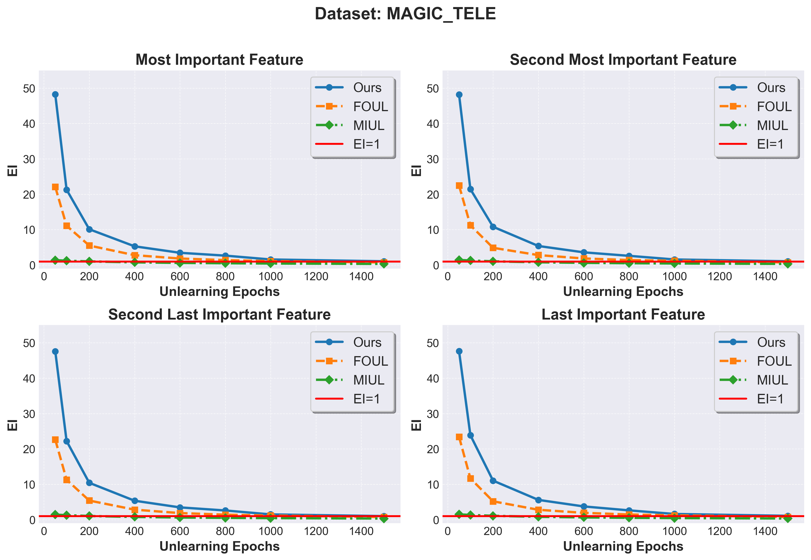

This repository includes the experimental setup, code, and results for the rebuttal of our paper \#13751, "**Efficient Feature Unlearning Using Shuffling: Algorithm and Theoretical Analysis.**". It offers additional details addressing three key aspects raised by the reviewers:

## Figure 1: Results of Advanced Model Architectures with the Most and Least Important Features for Unlearning
### CREDIT Dataset
|  |  |  |
| :----------------------------------------------------------: | :----------------------------------------------------------: | :----------------------------------------------------------: |
|                   <em>TRI MLP Results for Top Two Important (identified by Shapley values) Features</em>                   |                <em>TRI FtFormer Results for Top Two Important(identified by Shapley values) Features</em>                 |                 <em>TRI ResNet Results for Top Two Important(identified by Shapley values) Features</em>                  |

|  |  |  |
| :----------------------------------------------------------: | :----------------------------------------------------------: | :----------------------------------------------------------: |
|                   <em>EI MLP Results for Top Two Important (identified by Shapley values) Features</em>                    |                 <em>EI FtFormer Results for Top Two Important (identified by Shapley values) Features</em>                 |                  <em>EI ResNet Results for Top Two Important (identified by Shapley values) Features</em>                  |

|  |  |  |
| :----------------------------------------------------------: | :----------------------------------------------------------: | :----------------------------------------------------------: |
|                  <em>RASI MLP Results for Top Two Important (identified by Shapley values) Features</em>                   |                <em>RASI FtFormer Results for Top Two Important (identified by Shapley values) Features</em>                |                 <em>RASI ResNet Results for Top Two Important (identified by Shapley values) Features</em>                 |

|  |  |  |
| :----------------------------------------------------------: | :----------------------------------------------------------: | :----------------------------------------------------------: |
|                   <em>SDI MLP Results for Top Two Important (identified by Shapley values) Features</em>                   |                <em>SDI FtFormer Results for Top Two Important (identified by Shapley values) Features</em>                 |                 <em>SDI ResNet Results for Top Two Important (identified by Shapley values) Features</em>                  |

|  |  |  |
| :----------------------------------------------------------: | :----------------------------------------------------------: | :----------------------------------------------------------: |
|                   <em>SRI MLP Results for Top Two Important (identified by Shapley values) Features</em>                   |                <em>SRI FtFormer Results for Top Two Important (identified by Shapley values) Features</em>                 |                 <em>SRI ResNet Results for Top Two Important (identified by Shapley values) Features</em>                  |

### CALI Dataset
|  |  |  |
| :----------------------------------------------------------: | :----------------------------------------------------------: | :----------------------------------------------------------: |
|                   <em>TRI MLP Results for Top Two Important (identified by Shapley values) Features</em>                   |                <em>TRI FtFormer Results for Top Two Important(identified by Shapley values) Features</em>                 |                 <em>TRI ResNet Results for Top Two Important(identified by Shapley values) Features</em>                  |

|  |  |  |
| :----------------------------------------------------------: | :----------------------------------------------------------: | :----------------------------------------------------------: |
|                   <em>EI MLP Results for Top Two Important (identified by Shapley values) Features</em>                    |                 <em>EI FtFormer Results for Top Two Important (identified by Shapley values) Features</em>                 |                  <em>EI ResNet Results for Top Two Important (identified by Shapley values) Features</em>                  |

|  |  |  |
| :----------------------------------------------------------: | :----------------------------------------------------------: | :----------------------------------------------------------: |
|                  <em>RASI MLP Results for Top Two Important (identified by Shapley values) Features</em>                   |                <em>RASI FtFormer Results for Top Two Important (identified by Shapley values) Features</em>                |                 <em>RASI ResNet Results for Top Two Important (identified by Shapley values) Features</em>                 |

|  |  |  |
| :----------------------------------------------------------: | :----------------------------------------------------------: | :----------------------------------------------------------: |
|                   <em>SDI MLP Results for Top Two Important (identified by Shapley values) Features</em>                   |                <em>SDI FtFormer Results for Top Two Important (identified by Shapley values) Features</em>                 |                 <em>SDI ResNet Results for Top Two Important (identified by Shapley values) Features</em>                  |

|  |  |  |
| :----------------------------------------------------------: | :----------------------------------------------------------: | :----------------------------------------------------------: |
|                   <em>SRI MLP Results for Top Two Important (identified by Shapley values) Features</em>                   |                <em>SRI FtFormer Results for Top Two Important (identified by Shapley values) Features</em>                 |                 <em>SRI ResNet Results for Top Two Important (identified by Shapley values) Features</em>                  |

### MAGIC_TELE Dataset
|  |  |  |
| :----------------------------------------------------------: | :----------------------------------------------------------: | :----------------------------------------------------------: |
|                   <em>TRI MLP Results for Top Two Important (identified by Shapley values) Features</em>                   |                <em>TRI FtFormer Results for Top Two Important(identified by Shapley values) Features</em>                 |                 <em>TRI ResNet Results for Top Two Important(identified by Shapley values) Features</em>                  |

|  |  |  |
| :----------------------------------------------------------: | :----------------------------------------------------------: | :----------------------------------------------------------: |
|                   <em>EI MLP Results for Top Two Important (identified by Shapley values) Features</em>                    |                 <em>EI FtFormer Results for Top Two Important (identified by Shapley values) Features</em>                 |                  <em>EI ResNet Results for Top Two Important (identified by Shapley values) Features</em>                  |

|  |  |  |
| :----------------------------------------------------------: | :----------------------------------------------------------: | :----------------------------------------------------------: |
|                  <em>RASI MLP Results for Top Two Important (identified by Shapley values) Features</em>                   |                <em>RASI FtFormer Results for Top Two Important (identified by Shapley values) Features</em>                |                 <em>RASI ResNet Results for Top Two Important (identified by Shapley values) Features</em>                 |

|  |  |  |
| :----------------------------------------------------------: | :----------------------------------------------------------: | :----------------------------------------------------------: |
|                   <em>SDI MLP Results for Top Two Important (identified by Shapley values) Features</em>                   |                <em>SDI FtFormer Results for Top Two Important (identified by Shapley values) Features</em>                 |                 <em>SDI ResNet Results for Top Two Important (identified by Shapley values) Features</em>                  |

|  |  |  |
| :----------------------------------------------------------: | :----------------------------------------------------------: | :----------------------------------------------------------: |
|                   <em>SRI MLP Results for Top Two Important (identified by Shapley values) Features</em>                   |                <em>SRI FtFormer Results for Top Two Important (identified by Shapley values) Features</em>                 |                 <em>SRI ResNet Results for Top Two Important (identified by Shapley values) Features</em>                  |

## Figure 2: Advanced Model Architectures with the Highly Correlated  Features for Unlearning

*(a) This graph illustrates the resulted evaluation metrics of unlearning the 'Latitude'(Correlation for``Latitude`` and ``Longitude`` is 0.925) feature using the MLP, ResNet, and FtFormer models.*

*(b) This graph illustrates the resulted evaluation metrics of unlearning the 'Longtitude' (Correlation for``Latitude`` and ``Longitude`` is 0.925) feature using the MLP, ResNet, and FtFormer models.*

*(c) This graph illustrates the resulted evaluation metrics of unlearning the 'AveBedrms' (Correlation for``AveRooms` and `AveBedrms`is 0.848)  feature using the MLP, ResNet, and FtFormer models.*

*(d) This graph illustrates the resulted evaluation metrics of unlearning the 'NumberOfTimes90DaysLate' (Correlation for - `NumberOfTimes90DaysLate` and `NumberOfTime60-89DaysPastDueNotWorse`is 0.991) feature using the MLP, ResNet, and FtFormer models.*

*(e): This graph illustrates the resulted evaluation metrics of unlearning the 'NumberOfTime30-59DaysPastDueNotWorse' (Correlation for  `NumberOfTime30-59DaysPastDueNotWorse` and `NumberOfTime60-89DaysPastDueNotWorse` is 0.988) feature using the MLP, ResNet, and FtFormer models.*

*(f) This graph illustrates the resulted evaluation metrics of unlearning the 'fSize'  (Correlation for `fSize`: and `fConc` is 0.847) feature using the MLP, ResNet, and FtFormer models.*

## Figure 3: Implementing Unlearning for Image Classification Tasks using the CelebA Dataset.

*(a) This graph illustrates the resulted evaluation metrics of unlearning the nose feature for Big_Nose classification.*

*(b) This graph illustrates the resulted evaluation metrics of unlearning the eye feature for Eyeglasses classification."*

*(c) This graph illustrates the resulted evaluation metrics of unlearning the eye feature for Gender classification."*

*(d) This graph illustrates the resulted evaluation metrics of unlearning the nose feature for Gender classification."*

*(e) This graph illustrates the resulted evaluation metrics of unlearning ()the nose+eye feature for Gender classification"*

*(f) This graph illustrates the resulted evaluation metrics of unlearning the eye feature for Narrow_Eyes classification."*

*g This graph illustrates the resulted evaluation metrics of unlearning the nose feature for Pointy_Nose classification"*

### Figure 4: A Graph Demonstration for Unlearning with CelebA Dataset 

