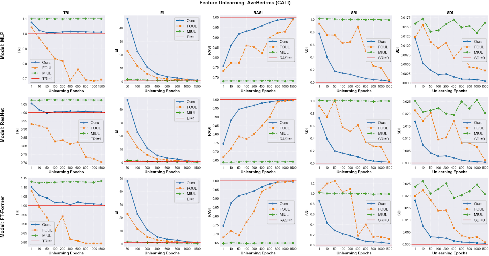

This repository contains the experimental setup, code, and results for our paper on "Feature Unlearning: Theoretical Foundations and Practical Applications with Shuffling". In response to reviewer comments regarding the simplicity of our initial models, we have incorporated more complex models, namely FtFormer and ResNet, to demonstrate the robustness and scalability of our unlearning approach.
 # Feature Unlearning with CelebA: Removing a Feature from a Computer Vision Task
 ## Dataset Overview

TCelebFaces Attributes Dataset (CelebA) is an extensive collection of over 200K celebrity images, each annotated with 40 binary facial attributes. The dataset captures a wide range of pose variations and background complexities. It offers remarkable diversity and volume, featuring 10,177 unique identities, 202,599 face images, and detailed annotations that include 5 landmark locations along with 40 binary attribute labels per image.

## Experiment Description

In this experiment, we first train a model to classify gender based on the celebrity images. Leveraging the dataset annotations, we then perform three distinct unlearning tasks:

- **Unlearn Noise:** Removing extraneous background details using the annotated noise locations.
- **Unlearn Eyes:** Excluding the eye regions based on the provided annotations.
- **Unlearn Noise+Eyes:** Simultaneously removing both the noise and the eyes.

These tasks help us evaluate how the removal of specific features affects model performance and robustness.

# Feature Unlearning: Leveraging Complex Model Architectures, Higher Feature Importance, and Correlation Analysis
 ## Expanded Model Architectures (Incorporating FtFormer and ResNet):
We have used three different models to demonstrate the efficacy and robustness of our feature unlearning approach:

- **MLP (Original)**: A classical neural network model consisting of multiple layers of perceptrons. It is widely used for tabular data and serves as our baseline model.
- **FtFormer**: A transformer-based model designed to handle sequential data.
- **ResNet**: A deep residual network known for its effectiveness in image processing tasks.

## Unlearning based on the Feature Importance
In the submitted manuscript, the features selected for unlearning are those identified as having the highest importance. To further demonstrate the effectiveness of our proposed method, we conducted additional experiments for each dataset which are focusing on:
- The **top two most influential features**, as determined by their Shapley values.
- The **least two influential features**, to assess the impact of unlearning less critical information.

Each of these features was unlearned across three different architectural frameworks:
1. MLP (as per the original experiments)
2. FtFormer
3. ResNet

### Results and Graphs
<table align="center">
  <tr>
    <td align="center">
      
      <br>
      <em>MLP Results</em>
    </td>
    <td align="center">
      
      <br>
      <em>FtFormer Results</em>
    </td>
    <td align="center">
      
      <br>
      <em>ResNet Results</em>
    </td>
  </tr>
</table>

<p align="center"><strong>Overall Caption:</strong> Comparison of the unlearning task performance across different model architectures.</p>


## Unlearning based on the Feature Correaltion

We also conducted experiments on features with high correlation coefficients to understand the effects of unlearning interdependent features. These experiments were carried out using the same three architectural frameworks (MLP, FtFormer, ResNet)mentioned above. **Our algorithm demonstrates remarkable efficiency in unlearning the features with high correlation, a capability that is consistently observed across multiple architectural frameworks, including MLP, ResNet, and FtFormer.**

Highly correlated features in *CALI* (threshold = 0.8):
- Latitude and Longitude: 0.925
- AveRooms and AveBedrms: 0.848
  
Features Unlearned: **Latitude, Longitude, AveBedrms**

Highly correlated features in *CREDIT* (threshold = 0.8):
- NumberOfTimes90DaysLate and NumberOfTime60-89DaysPastDueNotWorse: 0.991
- NumberOfTime30-59DaysPastDueNotWorse and NumberOfTime60-89DaysPastDueNotWorse: 0.988
- NumberOfTime30-59DaysPastDueNotWorse and NumberOfTimes90DaysLate: 0.983
  
Features Unlearned: **NumberOfTimes90DaysLate, NumberOfTime30-59DaysPastDueNotWorse**


Highly correlated features in *MAGIC_TELE* (threshold = 0.8):
- fConc: and fConc1:: 0.975
- fSize: and fConc:: 0.847
- fSize: and fConc1:: 0.804
  
Features Unlearned: **fSize**

Other datasets do not include features that exceed our set threshold (The code for checking feature correlation is available in: check_feature_correlation.ipynb).
 
### Results and Graphs

*Description: This graph illustrates the impact of unlearning the 'Latitude' feature using the MLP, ResNet, and FtFormer models. The red line represents the baseline, and our model's performance is consistent with observations reported in the main paper. It demonstrates robust performance across all evaluation criteria."*

*Description: This graph illustrates the impact of unlearning the 'Longtitude' feature using the MLP, ResNet, and FtFormer models. The red line represents the baseline, and our model's performance is consistent with observations reported in the main paper. It demonstrates robust performance across all evaluation criteria."s.*

*Description: This graph illustrates the impact of unlearning the 'AveBedrms' feature using the MLP, ResNet, and FtFormer models. The red line represents the baseline, and our model's performance is consistent with observations reported in the main paper. It demonstrates robust performance across all evaluation criteria."s.*

*Description: This graph illustrates the impact of unlearning the 'NumberOfTimes90DaysLate' feature using the MLP, ResNet, and FtFormer models. The red line represents the baseline, and our model's performance is consistent with observations reported in the main paper. It demonstrates robust performance across all evaluation criteria."s.*

*Description: This graph illustrates the impact of unlearning the 'NumberOfTime30-59DaysPastDueNotWorse' feature using the MLP, ResNet, and FtFormer models. The red line represents the baseline, and our model's performance is consistent with observations reported in the main paper. It demonstrates robust performance across all evaluation criteria."s.*

*Description: This graph illustrates the impact of unlearning the 'fSize' feature using the MLP, ResNet, and FtFormer models. The red line represents the baseline, and our model's performance is consistent with observations reported in the main paper. It demonstrates robust performance across all evaluation criteria."s.*

## How to Run Experiments

To replicate our experiments or to run new experiments using the setup provided, follow the instructions below:

```bash
# Clone the repository
git clone https://github.com/your-repository-url.git
